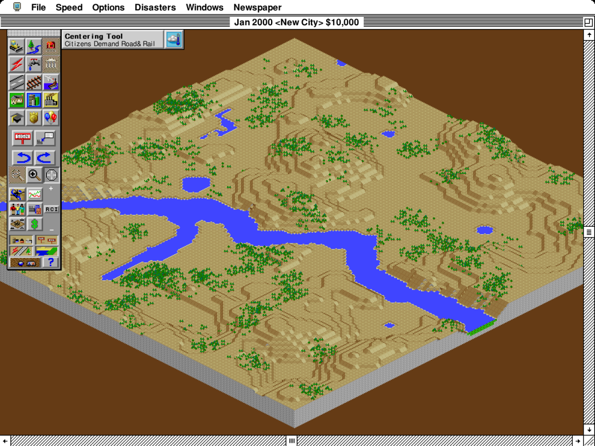

# SC2K fractional resize: city screenshots

Before: upstream `c72bc8db206733b2569ce03e0116573d55f48aab`. After: `98f9fe3cfd0ca67fab5345238afbd95480166872`.

These are matching full-city captures from deterministic native Windows replay frame 999. Guest instructions, ticks, framebuffer checkpoints and final RAM match. Native-size PNGs match byte-for-byte. At 138%, the new path integrates retained coverage directly into the final drawable instead of filtering through an intermediate integer-size image. Font sources, font weight, guest layout and pen advances are unchanged. The visual improvement is modest.

Open each image at its actual pixel size; GitHub or browser downscaling can obscure the comparison. `review.html` provides a local before/after toggle when downloaded with these PNGs.

**Before — master, 138% (1104 × 828).**

**After — one scaling step, 138% (1104 × 828).**

**Before — master, 100% (800 × 600).** Native-size pixels are identical before and after.

**After — one scaling step, 100% (800 × 600).** Native-size pixels are identical before and after.

