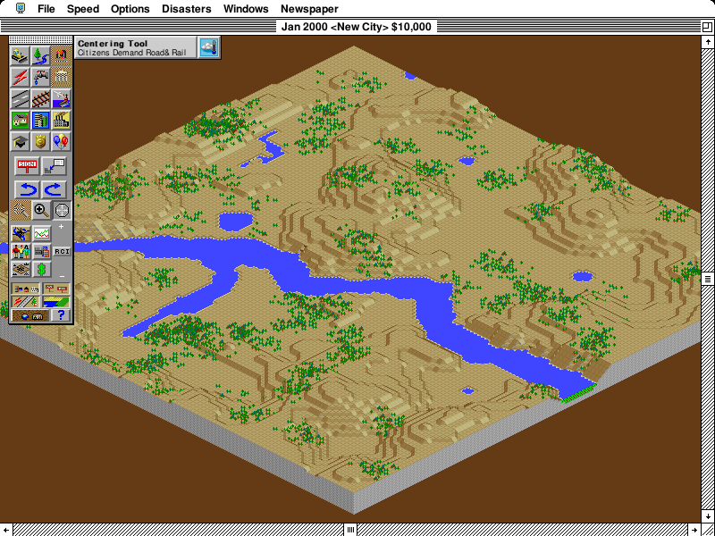

# Windows DirectWrite experiment

Archived on 2026-09-15 for possible future work. This is an opt-in prototype,
not an accepted sharpness fix or a proposed PR. After comparing matching SC2K
city views at native and resized dimensions, the reviewer preferred the existing
renderer, including over the closest weight-matched DirectWrite variant.

The branch starts from upstream `7d56f07` with the separate coverage-resize
optimization from PR #1949 cherry-picked as `7052d7b`. That prerequisite is not
part of the font experiment. The existing renderer remains the default.

## What is preserved

QuickDraw continues to determine guest pixels, clipping, character advances, and
pen positions. The existing presentation layer retains higher-resolution outline
coverage through saved pixels, offscreen copies, and recognized indexed
recoloring. The ordinary frontend expands that coverage and resizes the image to
fit the host window; fractional resizing can soften previously rasterized text.

This experiment additionally retains the original bundled font, glyph, baseline,
indexed colors, and drawing order for eligible text cells. After normal image
composition and scaling, a Windows overlay rasterizes the glyph at its final
physical size and fractional baseline. It does not ask DirectWrite to lay out a
string or substitute a Windows font. This follows the separation between pen
position, character width, and drawing described in
[Inside Macintosh: Text, "Text Is Graphics"](https://dev.os9.ca/techpubs/mac/Text/Text-16.html).
The separate SC2K character-spacing issue is not addressed here.

The Rust backend loads bundled font bytes through DirectWrite's in-memory loader,
owns the COM resources, and renders directly into an owned bitmap target. It
replaces the early external DLL prototype. No host fonts or Windows settings are
installed or changed. Unsupported drawing combinations retain the existing
presentation pixels. Supported cases are plain outline text in 8-bit indexed
displays; synthesized styles, complex backgrounds, and excessive overlapping
layers fall back. Ordinary guest writes invalidate retained glyph sources.

The archived selection uses unhinted Natural Symmetric curves, grayscale below
12 physical pixels per em, and subpixel coverage at 12 and above. The cutoff uses
the final scaled size, not only the guest's point size. The reviewer preferred
the smoother curves to the earlier hinted DirectWrite version, but found small
text lighter and some subpixel text visibly fringed on off-white backgrounds.

## Running the experiment

Build the Windows executable using the repository's normal build process. For
example, with the Rust Windows GNU target and MinGW linker configured:

```sh
cargo build --release --target x86_64-pc-windows-gnu --bin systemless
```

Run the resulting executable on Windows with these process-local variables:

```powershell
$env:SYSTEMLESS_CLEARTYPE_PROTOTYPE = '1'
$env:SYSTEMLESS_NATIVE_TEXT_CONTRAST = '0'
.\systemless.exe 'C:\path\to\game.kpak'
```

`SYSTEMLESS_NATIVE_TEXT_CONTRAST` accepts a constant correction from 0 to 1;
invalid values use 0. It adds to the selected enhanced-contrast parameters at
every size without a size-dependent weight fade. The comparison called "Weight
match A" used 0.5 and "Weight match B" used 1.0. Remove
`SYSTEMLESS_CLEARTYPE_PROTOTYPE` entirely to compare the existing renderer:
presence enables the experiment, so setting it to `0` does not disable it.

`SYSTEMLESS_PROFILE_RENDER_PHASES` prints detailed diagnostic timings and glyph
cache counts. Leave it unset for performance measurements; synchronous trace
output itself can affect latency.

## Appearance result

Increasing contrast brought aggregate darkness closer to the old renderer, but
did not make it preferable to the reviewer. Relative toolbar/menu integrated
darkness, with the old renderer equal to 1.0:

| Variant | Native toolbar / menu | Scaled toolbar / menu |
| --- | --- | --- |
| Standard DirectWrite | 0.805 / 0.899 | 0.836 / 0.921 |
| Weight match A, +0.5 | 0.911 / 0.948 | 0.910 / 0.962 |
| Weight match B, +1.0 | 0.989 / 0.987 | 0.965 / 0.993 |

These are diagnostic ink measurements, not perceptual quality scores. The final
feedback was: "The existing renderer still looks better."

The screenshots below show identical replay state and full city views. Inspect
the original files at one image pixel per physical display pixel; browser or
OS scaling of these embedded previews can change the comparison.

Existing renderer, 800×600:



DirectWrite Weight match B (+1.0), 800×600:


Existing renderer, 1104×828 (138%):


DirectWrite Weight match B (+1.0), 1104×828 (138%):


## Validation and remaining work

- The first Rust version passed 5,483 Windows library tests, with 3 ignored and
  none failing. That full-suite executable preceded the final DIB-height guard
  correction and later metadata/cache optimizations; it is not a full-suite
  result for this exact final snapshot.
- The corrected Rust backend matched the selected reference DLL's glyph bounds
  and all 4,502,204 pixels across 30,780 glyph cases.
- The latest snapshot passed resize round trips, saved/offscreen copies,
  indexed recoloring, antialiasing cutoff checks, and guest-byte invariance for
  four font/size pairs and two drawing modes across eleven output scales. Its
  196 artifacts at standard contrast matched the earlier version byte for byte.
- All four appearance variants produced identical final guest RAM and the four
  checked guest-frame snapshots. The city images above use that replay.
- [Initial performance results](performance-v1.md) show substantial regression.
  This snapshot includes subsequent metadata invalidation and glyph-cache lookup
  optimizations, but their performance has **not** been measured. No speedup is
  claimed for them. A separate master-only baseline is also still needed.
- Monitor-specific rendering parameters and cache invalidation on display or
  settings changes are unfinished. Broader game coverage and a full test run of
  this exact snapshot would be needed before considering shipping it.

`tools/` preserves the standalone appearance, deterministic replay, and
QuickDraw integration harness sources used during this work, plus the earlier
C reference backend. The harnesses are not Cargo examples or automated tests.
They link against this branch's Windows `systemless` and `image` libraries;
the replay/appearance programs need `--cfg native_text`. When linking a release
`systemless` rlib, use fat LTO because it contains LLVM bitcode. The replay and
appearance programs take `GAME_PATH OUTPUT_DIRECTORY WIDTH HEIGHT`; the
integration checker takes `OUTPUT_DIRECTORY` and additionally expects
`SYSTEMLESS_CHECK_SELECTED=1`. The SC2K archive and extracted game are not included.

The next sharpness experiment will use the existing Skrifa/Zeno renderer at the
final output size. DirectWrite remains preserved here rather than being enabled
as the default or presented as an accepted improvement.
